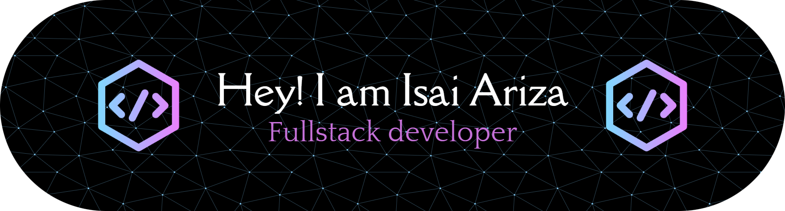

# 👨‍💻 Isai Ariza | Mechatronics Engineer & IoT Enthusiast

Hi there! I'm **Isai David Ariza Cantillo**, a Mechatronics Engineer with a strong foundation in software development and a deep passion for **IoT**, **automation**, and **intelligent systems** applied to healthcare.

I specialize in:

- ⚙️ **Design and development of mechatronic systems**
- 💻 **Programming with Python, JavaScript (Vanilla), Node.js, Express.js**
- 🌐 **Frontend with HTML, CSS and responsive design principles**
- 🧠 **Social impact tech solutions**, especially in health-focused projects
- 📡 **Home automation and the Internet of Things (IoT)**

  
  
  
  
  
  
  
  
  
  
  
  
  
  
  
  
  
  
  
  
  
  
  

###
---

## 🧠 Thesis Project — DOMUSTRACK

**Type of project:** Research, Development, and Innovation (R&D&I)  
**Start:** January 2024 — Ongoing  
**Title:** **DOMUSTRACK**  
**Role:** Developer, Systems Integrator, Co-author  

### 🏠 Mechatronic Tracking and Alert System for Alzheimer’s Patients

DOMUSTRACK is an innovative solution that integrates **mechatronics**, **home automation**, and **IoT intelligence** to enhance safety and autonomy for people living with Alzheimer's. Its main goal is to prevent unsupervised wandering through:

- 🔐 Real-time patient tracking
- 📲 Mobile app with Bluetooth connectivity (ESP32)
- 📍 Alert system based on RSSI (signal strength)
- 🧭 Web dashboard with indoor location via Flask
- 🏡 Smart home integration for secure access control

### 🎯 Impact

> DOMUSTRACK aims to significantly improve the quality of life of both Alzheimer’s patients and their caregivers by creating a safer, smarter environment that preserves autonomy and dignity.

#### 🔧 Technologies Used:
- ESP32, Bluetooth, Flask, Python, JavaScript  
- Home automation systems, sensors, real-time monitoring  
- Developed on Windows OS

---

## 🔗 Connect With Me

- 💼 [LinkedIn](https://www.linkedin.com/in/isai-david-ariza-cantillo-bab35b367)  
- 📸 [Instagram](https://www.instagram.com/isaiariza22?utm_source=qr&igsh=cWlmazltYW9rODFz)

---

## 💡 A Quote I Live By

> "Technology is not just about tools — it's about transforming lives."

