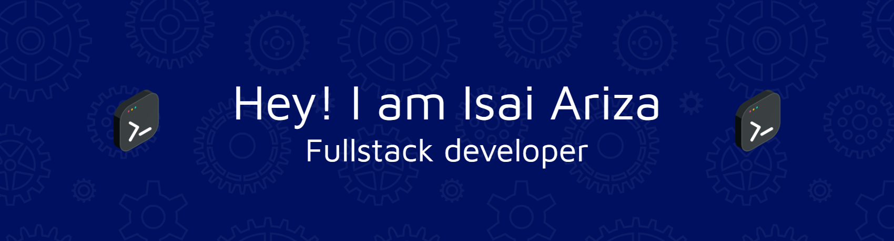

# 👨‍💻 Isai Ariza | Mechatronics Engineer & IoT Enthusiast

Hi there! I'm **Isai David Ariza Cantillo**, a Mechatronics Engineer with a solid foundation in software development and a deep passion for **IoT, automation**, and **intelligent systems** applied to healthcare.

---

## 💼 About Me

I specialize in:

- ⚙️ Design and development of mechatronic systems  
- 💻 Programming with Python, JavaScript (Vanilla), Node.js, Express.js  
- 🌐 Frontend with HTML, CSS, and responsive design principles  
- 🧠 Social impact tech solutions, especially in health-focused projects  
- 📡 Home automation and Internet of Things (IoT)

---

## 🛠️ Tech Stack

  
  
  
  
  
  
  
  
  
  
  
  

---

## 🧠 Thesis Project — DOMUSTRACK

> **Type**: Research, Development, and Innovation (R&D&I)  
> **Start**: January 2024 — Ongoing  
> **Title**: DOMUSTRACK  
> **Role**: Developer, Systems Integrator, Co-author

### 🏠 *Mechatronic Tracking and Alert System for Alzheimer’s Patients*

DOMUSTRACK is an innovative solution that integrates **mechatronics**, **home automation**, and **IoT** to enhance safety and autonomy for individuals living with Alzheimer’s. Its goal is to **prevent unsupervised wandering** through:

- 🔐 Real-time patient tracking  
- 📲 Mobile app with Bluetooth connectivity (ESP32)  
- 📍 Alert system based on RSSI (signal strength)  
- 🧭 Web dashboard with indoor tracking using Flask  
- 🏡 Smart home integration for secure access control  

### 🎯 Impact

DOMUSTRACK aims to significantly improve the **quality of life** of both Alzheimer’s patients and their caregivers, creating a **safer and smarter environment** that preserves autonomy and dignity.

### 🔧 Technologies Used

- ESP32, Bluetooth
- Flask, Python, JavaScript
- IoT sensors and real-time monitoring
- Windows OS

---

## 🔗 Connect With Me

- 💼 [LinkedIn](https://www.linkedin.com/in/isai-david-ariza-cantillo-bab35b367/)
- 📸 [Instagram](https://www.instagram.com/isaiariza22)
- 📄 [CvLAC - National Research Profile (Colombia)](https://scienti.minciencias.gov.co/cvlac/visualizador/generarCurriculoCv.do?cod_rh=0002091448)

---

## 💡 A Quote I Live By

> _"Technology is not just about tools — it's about transforming lives."_

